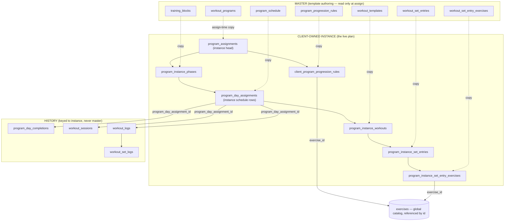

# Program Spine Rebuild — Complete Design Document

**Status:** ✅ LOCKED — executing. §10 open decisions resolved (see §10). Existing assignment/run/history data is **wiped** (maintenance mode; data loss explicitly accepted) — there is **no migration** of old data. This is the single coherent spec the whole rebuild executes against.

**Locked destination:** Per-client program **instances** (deep copy at assign time, client-owned, isolated) **+ fully live/derived analytics**. Propagation OFF. Completions keyed to the instance, never to master/template rows. Duration derived from phases. `category` removed.

---

## 0. Naming reality (grounding)

The exploration confirmed the real table names (not the generic names in the prompt). This document uses the real names throughout.

| Concept (prompt) | Real table today |
|---|---|
| programs | `workout_programs` |
| phases / blocks | `training_blocks` |
| master schedule | `program_schedule` |
| per-client schedule snapshot | `program_day_assignments` |
| master prescriptions | `program_progression_rules` |
| per-client prescriptions | `client_program_progression_rules` |
| completions ledger | `program_day_completions` |
| workout day content | `workout_templates` → `workout_set_entries` → `workout_set_entry_exercises` (+ protocol satellites) |
| session/log/set history | `workout_sessions`, `workout_logs`, `workout_set_logs` |
| exercise catalog (global) | `exercises` |

---

## 1. The problem, precisely (why this rebuild)

The current spine is a **half-built instance model**. Three layers are already per-client; three critical layers are still shared master rows. That mismatch is the root of every bug.

**Already per-client (good):**
- `program_assignments` — the enrollment, with snapshotted `name`, `description`, `timezone_snapshot`.
- `program_day_assignments` — per-client schedule snapshot (one row per day, `day_number`, `workout_template_id`, `is_customized`).
- `client_program_progression_rules` — per-client copy of prescriptions.

**Still shared master (the disease):**
1. **`program_schedule` (master) is the completion key.** `program_day_completions.program_schedule_id` and `workout_logs.program_schedule_id` both FK to **master** `program_schedule.id`. Editing/deleting a master schedule row **CASCADE-deletes every client's completions** (`program_day_completions` ON DELETE CASCADE) or **NULLs** the log key (`workout_logs` ON DELETE SET NULL). This is the data-integrity core failure.
2. **`training_blocks` (phases) are master-only.** There is no per-instance phase copy, so "Week X of **N** where N = sum of *the instance's* phases" is structurally impossible today — N is read from 4 different competing places (see §6).
3. **`workout_templates` / `workout_set_entries` / `workout_set_entry_exercises` (the actual workout content) are shared library rows.** `program_day_assignments.workout_template_id` is a **pointer** to a shared template. A coach editing a shared template silently changes every client and every program using it — direct violation of isolation.

**Propagation is ON today** (and must be removed): `WorkoutTemplateService.propagateScheduleSlotToSnapshots` / `propagateAllScheduleSlotsToSnapshots` push master `program_schedule` edits into active/paused `program_day_assignments` where `is_customized = false`. The `is_customized` flag exists *only* to protect cells from this propagation — once propagation is gone, `is_customized` loses its current meaning.

**Duration is a mess:** `workout_programs.duration_weeks` (manual, default 4), `training_blocks.duration_weeks` (per phase), and `program_assignments.duration_weeks` (per assignment) all coexist. `reconcileBlocksToDuration` (in `src/lib/workoutTemplateService.ts`) **destroys/extends/deletes phases** to force the block sum to match the manual `duration_weeks` — and on shrink it runs `cleanup_orphan_schedule` which deletes `program_schedule` rows (which CASCADE-deletes completions). `category` on `workout_programs` has no real consumer.

**The 4-source "Week X of N" inconsistency** (detailed in §6):
1. Calendar elapsed weeks (`compute_program_current_week` SQL / `computeCurrentProgramWeekForAssignment` TS) — authoritative for *unlock*.
2. Completion-ledger next-slot (`getProgramState` / `getCurrentWeekNumber`).
3. `program_progress.current_week_number` cache — still read by `get_client_dashboard`.
4. Total-weeks (N): assignment `duration_weeks` vs `workout_programs.duration_weeks` vs `MAX(program_schedule.week_number)` vs `SUM(training_blocks.duration_weeks)` vs distinct-week count.

**The fix is a single coherent build:** finish the instance model down to the workout content, re-key history to instance rows, remove propagation, derive duration from instance phases, and collapse "Week X of N" to one canonical resolver reading the instance + real progress.

---

## 2. Core architectural decisions (locked)

These are decided. The build does not re-litigate them.

**D1 — Full deep copy at assign time.** An assignment produces a complete client-owned instance: program metadata + phases + schedule + workout content (templates → set entries → exercises) + prescriptions. The **only** thing referenced by id (not copied) is the **global `exercises` catalog** and **`profiles`** — those are immutable-enough global catalogs, not program content. Everything a coach can edit *within a program* is copied.

> **Why copy workout content too (not just the pointer)?** Isolation (#1) and integrity (#4) require that nothing the client trains points at a mutable master/template row. `program_day_assignments.workout_template_id` pointing at a shared `workout_templates` row means a template edit changes the client. To honor "the coach edits a client's instance without affecting the template or any other client," the workout structure must be instance-owned. The `exercises` catalog stays shared because editing "Barbell Back Squat" name/metadata is a catalog concern, not a per-client plan concern, and the prescription stores the `exercise_id` pointer.

**D2 — `program_schedule.id` is NEVER a completion key again.** Completions, logs, and sessions key to **instance schedule rows** (`program_day_assignments.id`, repurposed as the instance schedule). Master `program_schedule` becomes a pure template authoring artifact, read only at assign time.

**D3 — Propagation removed entirely.** Master edits affect only **future** assignments. `propagateScheduleSlotToSnapshots` / `propagateAllScheduleSlotsToSnapshots` are deleted. `is_customized` is removed (every instance row is editable; there is nothing to "protect from propagation" anymore).

> **Future capability (note, not built now):** A "re-apply a template change to selected client instances" feature is possible later as a purely **additive** capability (a coach explicitly opts in to push a specific master edit onto chosen instances). The current architecture does **not** compromise for it — propagation stays fully OFF; per-client adaptation is by editing each instance. The deep-copy model is forward-compatible with such a feature without rework.

**D4 — Duration is derived, never stored as a manual program field.**
- Master `workout_programs.duration_weeks` → **dropped**. Master template duration = `SUM(training_blocks.duration_weeks)`.
- Instance duration = `SUM(program_instance_phases.duration_weeks)` (the instance's own copied phases).
- `program_assignments.duration_weeks` → **dropped** (instance derives from its phases).
- `reconcileBlocksToDuration` and its `cleanup_orphan_schedule` call → **deleted**. Phases are edited directly; the program/instance length follows the phases, not the other way around.

**D5 — `category` removed** from `workout_programs` (no real consumer). `workout_templates.category` is a *separate* column and is **kept** (it's the template library category, unrelated).

**D6 — One canonical resolver for "Week X of N" and adherence.** A single function (TS + a single SQL function) computes, from the instance + real progress:
- **N (total weeks)** = `SUM(program_instance_phases.duration_weeks)` for the instance.
- **X (current week)** = calendar-elapsed weeks since effective start, pause-adjusted, clamped to N (the existing `compute_program_current_week` math, but fed instance duration as the cap).
- Adherence = required instance schedule slots for week X vs instance-keyed completions.
Every surface reads this resolver. The `program_progress` cache and the 4 competing total-weeks derivations are retired.

**D7 — Idempotent, transactional assign via a single Postgres RPC.** The deep copy runs server-side in **one** `SECURITY DEFINER` function inside a transaction, so partial instances are impossible. The browser/TS path calls this RPC. No multi-step client-side saga.

**D8 — Re-assign = fresh instance.** Re-assigning the same client+program creates a **new** `program_assignments` row (new instance), archiving the prior one as `completed`. We do **not** reuse the assignment id and wipe history (the current `reset-run-data` reuse path is removed). History from prior instances is preserved under the old instance id.

**D9 — Relational vs JSONB project rule.** Use **relational columns/tables for anything the app queries, filters, aggregates, or joins on** — phases, schedule rows, week numbers, completions, adherence, prescriptions. Use **JSONB only for self-contained blobs that are read/written whole and never queried into** — i.e. set-protocol parameters (`program_instance_set_entry_protocols.protocol_config`). Structural/analytic data is **never** put in JSONB. This rule governs every new table in this rebuild.

---

## 3. Section A — Target data model

### 3.1 Overview of the instance tables



### 3.2 What gets copied at assign time (the instance layers)

| Master source | Instance target | Copy semantics |
|---|---|---|
| `workout_programs` row | `program_assignments` (instance head) | name, description copied (already today); add derived duration support |
| `training_blocks` (phases) | **`program_instance_phases`** (NEW) | one row per phase, with `duration_weeks`, `block_order`, goal, notes |
| `program_schedule` rows | `program_day_assignments` (REWORKED → instance schedule) | one row per scheduled day; gains `program_instance_phase_id`, `week_number`, stable `id` that history keys to |
| `workout_templates` (the day's workout) | **`program_instance_workouts`** (NEW) | one row per distinct template used by the instance's schedule |
| `workout_set_entries` | **`program_instance_set_entries`** (NEW) | the set/block structure of each instance workout |
| `workout_set_entry_exercises` | **`program_instance_set_entry_exercises`** (NEW) | exercise rows within each set entry; `exercise_id` references global `exercises` |
| protocol satellites (`workout_drop_sets`, `workout_cluster_sets`, `workout_time_protocols`, `workout_speed_sets`, `workout_endurance_sets`, …) | **`program_instance_set_entry_protocols`** (NEW, consolidated) OR per-protocol instance tables | copied so protocol params are instance-owned |
| `program_progression_rules` | `client_program_progression_rules` (REWORKED) | per-week prescription copy (already today); re-point FKs to instance set entries |

> **Protocol satellites decision (LOCKED — D9):** Today protocol params live in multiple satellite tables keyed to `workout_set_entries.id`. For the instance, consolidate them into a single `program_instance_set_entry_protocols` table (one row per instance set entry, `protocol_type` + JSONB `protocol_config`). Protocol params are a self-contained blob read/written whole and never queried/aggregated into — exactly the JSONB case per D9. The master authoring side keeps its existing relational satellite tables; the assign-time copy flattens them into the instance JSONB. Structural/analytic data (phases, schedule, week numbers, completions, prescriptions) stays relational.

### 3.3 New / reworked schema (DDL shape — for the one-paste migration)

> Conventions: all instance tables cascade-delete from their parent instance head (`program_assignments`) so deleting an instance cleanly removes its owned rows. History tables (`program_day_completions`, `workout_logs`, `workout_sessions`) do **not** cascade from schedule rows in a way that loses data — see §3.5.

**`program_instance_phases` (NEW)** — copy of `training_blocks` for one instance.
```sql
CREATE TABLE public.program_instance_phases (
  id uuid PRIMARY KEY DEFAULT gen_random_uuid(),
  program_assignment_id uuid NOT NULL
    REFERENCES public.program_assignments(id) ON DELETE CASCADE,
  source_training_block_id uuid NULL,              -- provenance only, NO FK (master may be deleted)
  name text NOT NULL,
  goal text NOT NULL DEFAULT 'custom',
  custom_goal_label text,
  duration_weeks integer NOT NULL DEFAULT 1 CHECK (duration_weeks >= 1),
  phase_order integer NOT NULL DEFAULT 1,
  progression_profile text DEFAULT 'none',
  notes text,
  created_at timestamptz NOT NULL DEFAULT now(),
  updated_at timestamptz NOT NULL DEFAULT now()
);
CREATE INDEX idx_pip_assignment_order
  ON public.program_instance_phases(program_assignment_id, phase_order);
```

**`program_day_assignments` (REWORKED — becomes the instance schedule + completion key).** Add columns; remove propagation-only columns.
```sql
-- Add: phase link + canonical week_number + instance workout link
ALTER TABLE public.program_day_assignments
  ADD COLUMN IF NOT EXISTS program_instance_phase_id uuid NULL
    REFERENCES public.program_instance_phases(id) ON DELETE SET NULL,
  ADD COLUMN IF NOT EXISTS week_number integer NULL,            -- canonical, was derived from day_number
  ADD COLUMN IF NOT EXISTS program_instance_workout_id uuid NULL;  -- FK added after PIW exists

-- Remove propagation machinery (D3) AFTER code stops reading it:
-- ALTER TABLE public.program_day_assignments DROP COLUMN IF EXISTS is_customized;
-- (is_completed / completed_date already non-canonical; drop in cleanup step)
```
`program_day_assignments.id` is the **stable instance schedule row id** that all history keys to. `(program_assignment_id, day_number)` stays unique.

**`program_instance_workouts` (NEW)** — copy of `workout_templates` used by this instance.
```sql
CREATE TABLE public.program_instance_workouts (
  id uuid PRIMARY KEY DEFAULT gen_random_uuid(),
  program_assignment_id uuid NOT NULL
    REFERENCES public.program_assignments(id) ON DELETE CASCADE,
  source_template_id uuid NULL,                    -- provenance only, NO FK
  name text NOT NULL,
  description text,
  estimated_duration integer,
  category text,                                    -- kept (template category, not program category)
  created_at timestamptz NOT NULL DEFAULT now(),
  updated_at timestamptz NOT NULL DEFAULT now()
);
CREATE INDEX idx_piw_assignment ON public.program_instance_workouts(program_assignment_id);

-- now wire program_day_assignments.program_instance_workout_id
ALTER TABLE public.program_day_assignments
  ADD CONSTRAINT pda_instance_workout_fk
  FOREIGN KEY (program_instance_workout_id)
  REFERENCES public.program_instance_workouts(id) ON DELETE SET NULL;
```

**`program_instance_set_entries` (NEW)** — copy of `workout_set_entries`.
```sql
CREATE TABLE public.program_instance_set_entries (
  id uuid PRIMARY KEY DEFAULT gen_random_uuid(),
  program_instance_workout_id uuid NOT NULL
    REFERENCES public.program_instance_workouts(id) ON DELETE CASCADE,
  source_set_entry_id uuid NULL,                   -- provenance only, NO FK
  set_order integer NOT NULL DEFAULT 1,
  set_name text,
  set_notes text,
  set_type text NOT NULL DEFAULT 'straight_set',
  total_sets integer,
  reps_per_set integer,
  duration_seconds integer,
  rest_seconds integer,
  created_at timestamptz NOT NULL DEFAULT now(),
  updated_at timestamptz NOT NULL DEFAULT now()
);
CREATE INDEX idx_pise_workout_order
  ON public.program_instance_set_entries(program_instance_workout_id, set_order);
```

**`program_instance_set_entry_exercises` (NEW)** — copy of `workout_set_entry_exercises`; references global `exercises`.
```sql
CREATE TABLE public.program_instance_set_entry_exercises (
  id uuid PRIMARY KEY DEFAULT gen_random_uuid(),
  program_instance_set_entry_id uuid NOT NULL
    REFERENCES public.program_instance_set_entries(id) ON DELETE CASCADE,
  exercise_id uuid NOT NULL REFERENCES public.exercises(id),  -- global catalog, referenced
  source_set_entry_exercise_id uuid NULL,          -- provenance only
  exercise_order integer NOT NULL DEFAULT 1,
  exercise_letter text,
  sets integer,
  reps text,
  weight_kg numeric,
  rir integer,
  tempo text,
  rest_seconds integer,
  load_percentage numeric,
  notes text,
  created_at timestamptz NOT NULL DEFAULT now()
);
CREATE INDEX idx_pisee_set_entry
  ON public.program_instance_set_entry_exercises(program_instance_set_entry_id);
```

**`program_instance_set_entry_protocols` (NEW)** — consolidated protocol params.
```sql
CREATE TABLE public.program_instance_set_entry_protocols (
  id uuid PRIMARY KEY DEFAULT gen_random_uuid(),
  program_instance_set_entry_id uuid NOT NULL
    REFERENCES public.program_instance_set_entries(id) ON DELETE CASCADE,
  protocol_type text NOT NULL,                     -- 'dropset' | 'cluster' | 'timed' | 'speed' | 'endurance' | ...
  protocol_config jsonb NOT NULL DEFAULT '{}'::jsonb,
  created_at timestamptz NOT NULL DEFAULT now()
);
CREATE INDEX idx_pisep_set_entry
  ON public.program_instance_set_entry_protocols(program_instance_set_entry_id);
```

**`client_program_progression_rules` (REWORKED).** Already per-instance. Re-point its structural references off master set entries onto instance set entries, and normalize the `block_*`/`set_*` column drift.
```sql
ALTER TABLE public.client_program_progression_rules
  ADD COLUMN IF NOT EXISTS program_instance_set_entry_id uuid NULL
    REFERENCES public.program_instance_set_entries(id) ON DELETE CASCADE,
  ADD COLUMN IF NOT EXISTS program_instance_phase_id uuid NULL
    REFERENCES public.program_instance_phases(id) ON DELETE SET NULL;
-- existing block_id (was master set_entry_id pointer) is retained transitionally,
-- then dropped in cleanup once readers move to program_instance_set_entry_id.
```

**`program_assignments` (REWORKED — instance head).**
```sql
-- D4: drop manual duration; instance duration derives from program_instance_phases
ALTER TABLE public.program_assignments DROP COLUMN IF EXISTS duration_weeks;  -- cleanup step
-- D8: remove the UNIQUE (program_id, client_id) constraint so re-assign creates a fresh instance
ALTER TABLE public.program_assignments
  DROP CONSTRAINT IF EXISTS program_assignments_program_id_client_id_key;
-- keep uq_one_active_program_per_client (one ACTIVE program per client) — still valid
-- keep pause columns, progression_mode, timezone_snapshot, start_date, status, coach_id
```

### 3.4 Master side (template authoring) — changes

- `workout_programs.duration_weeks` → **DROP** (D4). Master length = `SUM(training_blocks.duration_weeks)`.
- `workout_programs.category` → **DROP** (D5).
- `reconcileBlocksToDuration` + `cleanup_orphan_schedule` → **DELETE** (D4). Phase editing directly defines length.
- `program_schedule`, `training_blocks`, `program_progression_rules`, `workout_templates`, `workout_set_entries` remain the authoring model — unchanged in shape, but **only read at assign time** and never referenced by instance/history FKs.

### 3.5 Section A — Completion re-keying (the data-integrity core)

**Today (broken):** completions/logs/sessions FK to **master** `program_schedule.id`.

**Target:** all history keys to the **instance schedule row** `program_day_assignments.id`.

| Table | New key column | FK | ON DELETE | Notes |
|---|---|---|---|---|
| `program_day_completions` | `program_day_assignment_id uuid NOT NULL` | `program_day_assignments(id)` | **CASCADE** (instance row delete removes its completion — acceptable; instance is client-owned and editing a day is intentional) | replaces `program_schedule_id` |
| `workout_logs` | `program_day_assignment_id uuid NULL` | `program_day_assignments(id)` | **SET NULL** (history survives even if schedule row removed) | replaces `program_schedule_id` |
| `workout_sessions` | `program_day_assignment_id uuid NULL` | `program_day_assignments(id)` | **SET NULL** | replaces `program_schedule_id` |
| `workout_set_logs` | (unchanged) | via `workout_log_id` | CASCADE from log | no direct schedule key — fine |

```sql
ALTER TABLE public.program_day_completions
  ADD COLUMN program_day_assignment_id uuid NULL
    REFERENCES public.program_day_assignments(id) ON DELETE CASCADE;

ALTER TABLE public.workout_logs
  ADD COLUMN program_day_assignment_id uuid NULL
    REFERENCES public.program_day_assignments(id) ON DELETE SET NULL;

ALTER TABLE public.workout_sessions
  ADD COLUMN program_day_assignment_id uuid NULL
    REFERENCES public.program_day_assignments(id) ON DELETE SET NULL;

-- New uniqueness for completions (one completion per instance day):
-- added in paste #2A (step 11), after write paths are proven at the verification gate.
-- ALTER TABLE public.program_day_completions
--   ADD CONSTRAINT uq_pdc_assignment_day UNIQUE (program_assignment_id, program_day_assignment_id);
```

**Why this kills the orphan class:** the instance schedule row (`program_day_assignments`) is owned by the client's `program_assignments`. Master `program_schedule` edits/deletes no longer touch it. The only way a completion disappears is if the coach deletes the **client's own** instance day — which is an explicit, scoped action on that one client, and uses `SET NULL` on logs so the log history itself still survives even then.

**Resolving the schedule row at write time (new contract):** when a client starts/completes a program day, the start route already resolves the `program_day_assignments` row for `(program_assignment_id, day_number)`. We store `program_day_assignment_id` directly on the session/log at start. The completion ledger insert in `completeWorkoutService` reads `program_day_assignment_id` off the log instead of resolving master `program_schedule.id`. **Every log-creation path must stamp `program_day_assignment_id`** (closing the current gap where `log-set` and `block-complete` create logs without program columns — see §8).

### 3.6 Section A — Where derived instance duration lives

- **Not stored.** Instance duration (N) = `SELECT COALESCE(SUM(duration_weeks),0) FROM program_instance_phases WHERE program_assignment_id = :id`.
- Exposed via the canonical resolver (§6) and, for SQL readers, via a small helper `program_instance_total_weeks(p_assignment_id uuid) RETURNS integer`.
- `program_day_assignments.week_number` (canonical, copied at assign) provides the schedule's week distribution; the **sum of phase durations** is the authority for N and they are kept consistent at assign time (phases define weeks, schedule days fall within them).

---

## 4. Section B — Assign-time copy

### 4.1 Single transactional RPC

Replace the client-side saga (`createProgramAssignment` → `assignProgramToClients` → `copyProgramRulesToClient` → snapshot upsert) with one `SECURITY DEFINER` Postgres function:

```
assign_program_instance(
  p_program_id uuid,
  p_client_id uuid,
  p_coach_id uuid,
  p_start_date date,
  p_progression_mode text,
  p_timezone_snapshot text,
  p_notes text
) RETURNS uuid   -- the new program_assignments.id
```

**Order of operations (all inside one transaction):**

1. **Auth/ownership check** — coach owns the program and the client (RLS / explicit `auth.uid()` check, matching the existing `20260409` security pattern).
2. **Deactivate prior active** — `UPDATE program_assignments SET status='completed' WHERE client_id=p_client_id AND status='active'` (preserves history under old instance ids; honors `uq_one_active_program_per_client`).
3. **Insert instance head** — new `program_assignments` row: `client_id`, `program_id`, `coach_id`, `start_date`, `status='active'`, `progression_mode`, `timezone_snapshot`, snapshotted `name`/`description` from `workout_programs`. **No `duration_weeks`** (derived). Capture `v_assignment_id`.
4. **Copy phases** — `training_blocks` (ordered by `block_order`) → `program_instance_phases`, keeping `source_training_block_id`. Build a map `master_block_id → instance_phase_id`.
5. **Copy workout content** — for each **distinct** `template_id` referenced by `program_schedule` for this program:
   - `workout_templates` → `program_instance_workouts` (map `master_template_id → instance_workout_id`).
   - `workout_set_entries` → `program_instance_set_entries` (map).
   - `workout_set_entry_exercises` → `program_instance_set_entry_exercises` (references global `exercises`).
   - protocol satellites → `program_instance_set_entry_protocols` (flattened to JSONB).
6. **Copy schedule** — `program_schedule` rows → `program_day_assignments`: set `day_number = (week_number-1)*7 + day_number`, `week_number`, `program_instance_phase_id` (via block map), `program_instance_workout_id` (via template map), `day_type`, `name`, `description`, `is_optional`. No `is_customized`.
7. **Copy prescriptions** — `program_progression_rules` → `client_program_progression_rules`, mapping `program_schedule_id`→instance day, `set_entry_id`→`program_instance_set_entry_id`, `training_block_id`→`program_instance_phase_id`; `exercise_id` references global catalog.
8. **Return** `v_assignment_id`.

**Snapshotted at assign:** everything in steps 3–7 (program meta, phases, schedule, workout content, prescriptions). `timezone_snapshot` continues to capture the client TZ at assign time.

**Idempotency:** the RPC is **not** "upsert into the same instance" — it always creates a **fresh instance** (D8). Idempotency is achieved by the caller guarding double-submits (UI disables the assign button while in flight) and by the transaction being all-or-nothing. Re-running produces a new instance; it never partially mutates an existing one.

**Failure / rollback:** single transaction → any failure rolls back the entire instance. No orphan `program_assignments`, no half-copied schedule. The current orphan-cleanup/`reset-run-data` machinery is removed.

### 4.2 Bulk assign

`assignProgramToClients(programId, clientIds[], …)` becomes a loop (or set-based RPC) that calls `assign_program_instance` once per client, each in its own transaction. Result shape stays `{ successful[], failed[] }` for per-client partial-success reporting, but each client either gets a complete instance or nothing. The orphaned legacy `process_bulk_program_assignment` RPC and `BulkAssignment.tsx` path are removed/ignored.

### 4.3 Re-assign behavior (D8)

- **Same client + same program again:** prior active instance → `completed` (its history stays under its own `program_assignments.id`), a **new** instance is created from the current master template. No id reuse, no `reset-run-data`. The dropped `UNIQUE (program_id, client_id)` constraint makes multiple instances of the same program for one client legal (one active at a time via `uq_one_active_program_per_client`).
- **"Reset" semantics:** if a coach wants a clean restart, that's just a re-assign (new instance). The old run history remains queryable/archived.

---

## 5. Section C — Coach editing an instance

### 5.1 The per-client instance editor

Route stays `/coach/clients/[id]/programs/[programId]` but now edits **instance-owned rows** exclusively. Nothing it does touches master.

**Editable on the instance:**
- **Phases** (`program_instance_phases`): rename, reorder, change `duration_weeks`, add/remove a phase. Changing phase durations changes the instance's N (derived) and recomputes "Week X of N" cleanly (§6).
- **Schedule days** (`program_day_assignments`): change which instance workout a day uses, mark optional, change day_type, add/remove a day within a week. The PATCH endpoint `…/snapshot/[snapshotRowId]` is reworked to operate on instance rows and never read master `program_schedule` (the `reset_to_template` branch is removed — there is no live template link anymore; "reset" means re-assign).
- **Workout content** (`program_instance_workouts` / set entries / exercises / protocols): edit the actual sets/reps/exercises for *this client* — fully isolated.
- **Prescriptions** (`client_program_progression_rules`): per-week prescription edits (existing `ClientProgressionEditor`), re-pointed to instance set entries.

**Confirmation that propagation is off:** there is no code path from master edits to instances. `propagateScheduleSlotToSnapshots` and `propagateAllScheduleSlotsToSnapshots` are deleted; `setProgramSchedule` / `removeProgramSchedule` / `programDraftCommit` no longer call them. `is_customized` is removed.

### 5.2 What "edit the template" means now

- Editing `workout_programs` / `training_blocks` / `program_schedule` / `program_progression_rules` / `workout_templates` affects **only future assignments**. Active instances are untouched.
- **"Duplicate program" coach flow:** keep/confirm a master-level "duplicate program" action (clone `workout_programs` + its phases/schedule/templates/rules into a new master template) so coaches can fork a template for authoring without affecting anyone. This is a master→master copy, distinct from assign (master→instance). If it doesn't already exist as a clean action, it is added in this rebuild.

---

## 6. Section D — Live analytics (single canonical resolver)

### 6.1 The canonical resolver

**TS:** `resolveInstanceProgramWeek(assignment, instancePhases, clientTz, targetYmd?) → { currentWeek, totalWeeks, clamped, isComplete }`
**SQL:** `get_program_instance_week(p_assignment_id uuid, p_target_date date DEFAULT NULL) → (current_week int, total_weeks int, clamped bool)`

Definition:
- **N (totalWeeks)** = `SUM(program_instance_phases.duration_weeks)` for the instance. (Never assignment `duration_weeks`, never `workout_programs.duration_weeks`, never `MAX(schedule.week_number)`.)
- **X (currentWeek)** = existing calendar math `compute_program_current_week(start_date, pause_accumulated_days, pause_status, paused_at, timezone_snapshot, target)`, then `LEAST(X, N)` with `clamped = X > N`.
- **isComplete** = `status='completed'` OR (X reaches N AND all required instance slots in week N are completed).
- **Adherence(week w)** = required instance slots (`program_day_assignments` where `week_number=w` and not `is_optional`) vs instance-keyed completions (`program_day_completions.program_day_assignment_id`).

This is the **only** place X, N, and adherence are computed. `program_progress` is **dropped entirely** (§6.3); `current_week_number` is always derived.

### 6.2 Re-pointing every reader (the audit → action list)

| Reader (file) | Today | After |
|---|---|---|
| `get_train_page_data` RPC | calendar week + `COALESCE(pa.duration_weeks, wp.duration_weeks, 4)` | `get_program_instance_week` (N from instance phases) |
| `get_client_dashboard` RPC | `program_progress.current_week_number` + `COALESCE(pa.duration_weeks, wp.duration_weeks, 1)` | `get_program_instance_week` |
| `get_coach_client_training` RPC | calendar (already) | `get_program_instance_week` (N from phases) |
| `get_gym_console_status` RPC | `program_progress.current_week_number` | `get_program_instance_week` |
| `src/lib/programWeekStateBuilder.ts` (`buildProgramWeekState`) | unlock=calendar, display=ledger next-slot, N=distinct schedule weeks | `resolveInstanceProgramWeek`; `currentWeekNumber` = calendar (align with train mapper) |
| `src/lib/trainPageDataMapper.ts` | calendar + distinct schedule weeks | resolver |
| `src/lib/clientDashboardPageData.ts` | overlays train RPC over dashboard RPC; `programProgress` left on cache | resolver everywhere; remove overlay hack |
| `src/lib/coachDashboardService.ts` | calendar (UTC!) + assignment `duration_weeks` | resolver with **client TZ** (fix UTC bug) |
| `src/lib/coach/controlRoomService.ts` | calendar + assignment duration | resolver |
| `src/lib/clientAnalyticsService.ts` | calendar + `resolveProgramTotalDisplayWeeks` | resolver |
| `src/lib/athleteScoreService.ts` | calendar week for due slots | resolver (`currentWeek`) + instance slots |
| `src/app/api/coach/analytics/overview/route.ts` | calendar + `duration_weeks` or hardcoded **12** | resolver (kill the `12` default) |
| `src/app/api/coach/analytics/adherence/route.ts` | calendar + master `program_schedule` + `program_day_completions(program_schedule_id)` | resolver + instance slots + instance-keyed completions |
| `src/app/api/coach/clients/[clientId]/summary/route.ts` | calendar ÷ `duration_weeks` | resolver |
| `src/app/api/client/program-week/route.ts` | `buildProgramWeekState` | resolver-backed builder |
| `src/lib/programDurationResolver.ts` (`resolveProgramTotalDisplayWeeks`) | 3-way fallback | **deleted**; N = phase sum only |
| `src/lib/programStateService.ts` (`getTotalWeeksForProgram`) | `MAX(week_number)` | **deleted**; use resolver |

**Adherence/completions readers re-point from `program_schedule`+`program_schedule_id` to instance schedule + `program_day_assignment_id`:** `adherence/route.ts`, `coachDashboardService.ts`, `controlRoomService.ts`, `progress/overview/route.ts`, `ClientWorkoutsView.tsx`, `clientAnalyticsService.ts`, and SQL RPCs `get_coach_client_training_week_schedule`, `get_train_page_data*`, `get_gym_console_status`, `20260202_client_summary_rpc.sql`.

**Progress reads re-point from master join to instance:** `getCompletedSlots` / `getProgramState` / `getNextSlot` (`programStateService.ts`), `weekComplianceService.ts`, `programMetricsService.ts` read `program_day_completions.program_day_assignment_id` joined to `program_day_assignments` (no master `program_schedule` join).

### 6.3 `program_progress` cache — DROPPED (LOCKED)

`program_progress` is **dropped entirely**. `current_week_number` is always derived via the canonical resolver — no cache, no stale risk. All readers (`get_client_dashboard`, `get_gym_console_status`, `updateProgressCache` writer, `gym-console/status` fallback, legacy pickup RPCs) are re-pointed to the resolver, then the table is dropped in paste #2B (step 12). The `updateProgressCache` write path is deleted.

---

## 7. Section E — Clean schema build + wipe (NO migration)

**LOCKED simplification:** the app is in maintenance mode and **loss of existing assignment/run/history data is explicitly accepted.** There is **no migration** of old data — no history re-keying, no phase approximation, no 0-orphan backfill gate, no two-paste backfill sequencing. The riskiest part of the rebuild is removed.

Instead, the schema migration is a **clean build**: create the new instance tables, add the new columns, and **one-time wipe** the assignment + run/history data so the new model starts fresh. New assignments create full instances via the new RPC from day one.

**Wiped (assignment + run/history data — there is no old data to convert or protect):**
- `program_assignments`
- `program_day_assignments`
- `client_program_progression_rules`
- `program_day_completions`
- `workout_sessions`
- `workout_logs`
- `workout_set_logs`
- (plus dependent rows that cascade from the above, and `program_progress` which is being dropped)

**Kept intact (authoring templates — untouched):**
- `workout_programs`, `training_blocks`, `program_schedule`
- `workout_templates`, `workout_set_entries`, `workout_set_entry_exercises` (+ master protocol satellites)
- `program_progression_rules`
- `exercises` (global catalog)

**Delivery:** the schema build + wipe is **paste #1** (one SQL script, run manually in the Supabase SQL editor — no Cursor-run migrations). The destructive `program_schedule_id`/legacy-column drops happen later in **paste #2B** (step 12), only after the new write/read paths are proven at the verification gate. This split is *not* about preserving data (it's all wiped); it's so the codebase stays buildable — the old columns must still exist while the old read paths are being swapped out.

**Order within paste #1:**
1. **Wipe** the assignment + run/history tables (TRUNCATE … CASCADE / DELETE), inside a transaction.
2. **Create** the new instance tables (`program_instance_phases`, `program_instance_workouts`, `program_instance_set_entries`, `program_instance_set_entry_exercises`, `program_instance_set_entry_protocols`).
3. **Add** the new nullable columns: instance links on `program_day_assignments` (`program_instance_phase_id`, `week_number`, `program_instance_workout_id`); instance refs on `client_program_progression_rules` (`program_instance_set_entry_id`, `program_instance_phase_id`); `program_day_assignment_id` on `program_day_completions` / `workout_logs` / `workout_sessions`.
4. **Indexes** for the new tables/columns.

No backfill. No orphan reconciliation. Tables start empty and are populated only by the new assign RPC.

---

## 8. Section F — Full test surface (browser, mandatory)

Each scenario is verified in the browser against real data.

**Assign → instance created correctly**
1. Coach assigns program P to client A. Verify a new `program_assignments` row + full instance: `program_instance_phases` = P's phases, `program_day_assignments` covers all days with correct `week_number`/phase links, `program_instance_workouts`+set entries+exercises copied, `client_program_progression_rules` copied. No rows reference master ids as keys.
2. Assign fails midway (simulate) → transaction rolls back → no partial instance, no orphan assignment.

**Coach edits template → active client unchanged**
3. With A active on P, coach edits P's master schedule/phases/template/prescriptions. Verify A's instance, train page, "Week X of N", and workout content are **unchanged**.
4. New client B assigned P **after** the edit → B's instance reflects the edit.

**Coach edits client's instance → only that client changes**
5. Coach edits A's instance (phase duration, a day's workout, a prescription, an exercise). Verify A's train page reflects it; client C (also on P) and master P are unchanged.

**Completions survive instance edits (no orphans)**
6. A completes several days (logs + set logs + ledger). Coach then edits/deletes a *different* day's workout in A's instance. Verify completed history intact, set logs intact, adherence unchanged.
7. Coach changes phase durations after A has completions → "Week X of N" recomputes (new N) and prior completions still map to their days.
8. Delete a still-future instance day → its (none) completions handled; logs for other days untouched (`SET NULL` only affects that day if any).

**Multi-client isolation**
9. P assigned to A, B, C. Edit each instance differently. Verify three divergent plans, master P pristine.

**"Week X of N" correct & live across all surfaces**
10. For client A, verify identical X and N on: client train page, client home/dashboard, coach client grid, coach client daily review, coach analytics overview (`W{X}/{N}`), adherence, client analytics view, workout-complete page. (Today these disagree — this is the regression-killer test.)
11. Pause then resume A → X stops advancing during pause, resumes after; N unchanged; all surfaces agree.
12. A behind calendar (missed weeks) → X (calendar) and adherence both correct and consistent.

**Duration derived correctly**
13. Instance N = sum of instance phase durations on every surface. Editing instance phases changes N live. Master template length = sum of master phases. No manual `duration_weeks` anywhere.

**Re-assign**
14. Re-assign P to A → new instance created, old instance archived `completed`, old history preserved under old id, new instance fresh. Only one active.
15. Assign a *different* program to A → prior active → completed, new active instance.

**Deletion safety**
16. Coach unassigns/deletes A's instance → instance-owned rows cascade-removed; verify no other client affected; verify (per policy) logs `SET NULL` retain history rows.
17. Coach deletes master program P → existing instances + their history fully intact (instances don't FK master as keys).
18. Coach deletes a master `workout_template`/set entry → no active instance or completion affected.

**Write-path coverage (gap closure)**
19. Start a program workout via every entry path (program-workouts start, start-from-progress, gym-console, coach pickup, and the `log-set`/`block-complete` first-set-create paths) → every resulting `workout_logs` row has `program_day_assignment_id` set; completion writes ledger keyed to instance.

---

## 9. Section G — Build order (one continuous rebuild)

Sequenced so the codebase stays buildable throughout. Not ship-and-wait stages — the implementation order of one effort. **One hard checkpoint: the verification gate after step 4.** (No existing-data backfill — that step is gone per §7.)

1. **Schema build + wipe (paste #1).** Wipe assignment/run/history tables; create instance content tables; add new nullable columns (instance links on `program_day_assignments`, instance refs on progression rules, `program_day_assignment_id` on history). Nothing reads them yet. *(Clean build — no backfill.)*

2. **Canonical resolver first.** Implement `resolveInstanceProgramWeek` (TS) + `get_program_instance_week` (SQL) + `program_instance_total_weeks`. Pure additions, no caller changes yet.

3. **Assign RPC.** Implement `assign_program_instance` (full deep copy, transactional). Wire `assignProgramToClients` to call it. Remove the old client-side assign saga. *(Risk: copy completeness — test instance contents row-for-row.)*

4. **Write paths stamp instance schedule id.** Update every log/session/completion creation path to set `program_day_assignment_id` (close the `log-set`/`block-complete` gap). `completeWorkoutService` writes ledger keyed to instance. *(Risk: missed path → un-keyed history. Covered by test #19.)*

   **>>> VERIFICATION GATE (hard checkpoint) <<<** Before proceeding past step 4, verify in the browser: assign creates a complete, correct instance; starting/completing workouts via **every** entry path stamps the instance id (test #19); completions land keyed to the instance; **no un-keyed history is produced.** Only proceed when proven — steps 6+ remove the old read paths and step 12 drops the old columns, so the new writes must be proven first.

5. *(removed — no existing-data backfill; data is wiped per §7.)*

6. **Read paths re-point to instance.** Move all progress/adherence/Week-X-of-N readers (the §6.2 table) to the resolver + instance schedule + `program_day_assignment_id`. Remove `resolveProgramTotalDisplayWeeks`, `getTotalWeeksForProgram`, the `clientDashboardPageData` overlay hack, the analytics `12` default, and fix the coach-dashboard UTC bug.

7. **Remove propagation.** Delete `propagateScheduleSlotToSnapshots` / `propagateAllScheduleSlotsToSnapshots` and their callers in `setProgramSchedule`/`removeProgramSchedule`/`programDraftCommit`/`stationDayWorkout`. Stop reading `is_customized`.

8. **Per-client instance editor.** Rework `…/snapshot/[snapshotRowId]` PATCH + `ClientProgressionEditor` + the program detail page to edit instance-owned rows only (no master reads, no `reset_to_template`). Add phase/workout-content instance editing UI.

9. **Duration cleanup.** Delete `reconcileBlocksToDuration` + `cleanup_orphan_schedule` usage; master length = phase sum; remove manual `duration_weeks` writes; remove `category` writes/reads.

10. **Re-assign = fresh instance.** Drop `UNIQUE(program_id, client_id)`; remove id-reuse + `reset-run-data` path; assign always inserts a new instance.

11. **Add constraints (paste #2A).** After write paths proven at the gate and code deployed: `program_day_completions.program_day_assignment_id NOT NULL` + `uq_pdc_assignment_day`.

12. **Cleanup migration (paste #2B), AFTER 6/7/11 ship.** Drop master-keyed history columns (`program_schedule_id` on `program_day_completions`/`workout_logs`/`workout_sessions`), `workout_programs.duration_weeks`/`category`, `program_assignments.duration_weeks`, `program_day_assignments.is_customized`, and `program_progress`. *(Risk: ordering — only after readers/writers moved.)*

13. **Full browser test pass** (§8) across all scenarios, then lock.

**Riskiest, called out explicitly:** step 4 (write-path instance stamping — the verification gate; any miss orphans new history), and step 12 (dropping old columns — only after readers/writers fully moved).

---

## 10. Resolved decisions (LOCKED)

1. **Protocol satellites → JSONB consolidated.** `program_instance_set_entry_protocols` (`protocol_type` + `protocol_config jsonb`). Generalized as project rule **D9**: relational for anything queried/filtered/aggregated/joined (phases, schedule, week numbers, completions, adherence, prescriptions); JSONB only for self-contained blobs read/written whole and never queried into (protocol params). Structural/analytic data is never moved into JSONB.
2. **`program_progress` → dropped entirely.** Week/progress always derived via the canonical resolver (§6.3).
3. **Pre-existing instance phases → N/A.** Existing data is wiped (§7); nothing to approximate.
4. **Orphaned history re-homing → N/A.** Existing data is wiped (§7); no re-keying, no orphans to re-home.
5. **Exercise catalog → referenced by `exercise_id`, not copied.** Instances copy the *plan* (workouts / set entries / exercise prescriptions); the global `exercises` catalog stays a single shared table everything points at.

**Existing data:** wiped (maintenance mode; data loss accepted). No migration. See §7.

---

*End of design document. LOCKED — executing the rebuild against this spec, starting at §9 step 1 (paste #1).*
